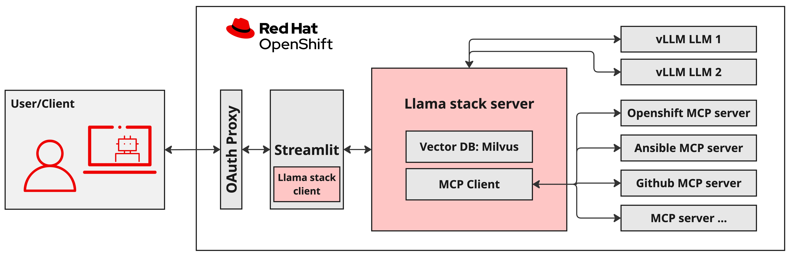

# City Permitting Agent

The City Permitting AI Agent (CPA) leverages artificial intelligence to streamline a laborious, but critical governmental process by automatically reviewing submitted forms for completeness and accuracy before they reach human officers. CPA has ingested a trove of official municipal and business-specific requirements which are necessary to issue a permit for a new establishment (such as a food truck). This source of knowledge will be used to pre-screen new permit requests.

Using a scorecard mechanism, the system highlights errors, missing information, and compliance gaps so that the requester is given the greatest chance of permit issuance upon official review. Once an optimal score is achieved, the system maintains a human-in-the-loop approach by submitting to a real human to ensure accountability and oversight. The solution enhances operational efficiency, reduces bottlenecks, and improves citizen experience by accelerating the turnaround time for permits without compromising regulatory compliance.

Our demo focuses on Food Truck permits in the city of Denver, Colorado as this is a real-life example, but the concept is easily extended to city permits of all types across the world.

## 🏗️ Repository Structure

This repository is designed as a **comprehensive demonstration platform** for building AI applications with Llama Stack. It follows a modular architecture with three main demonstration patterns:

### Core Architecture

```
city-permitting-agent/
├── kubernetes/              # Complete deployment manifests
└── images/                  # Documentation assets
```

### Infrastructure Components

The repository includes complete Kubernetes/OpenShift deployment manifests:

- **llama-serve/**: vLLM model servers (GPU-accelerated)
- **llama-stack/**: Core Llama Stack orchestration server
- **mcp-servers/**: Model Context Protocol tool servers for Slack, databases, web search, and K8s operations
- **Vue UI/**: Web UI deployment
- **Node.js Server/**: Hosting server for web UI and connectivity to Llama Stack
- **observability/**: Monitoring and metrics collection
- **kustomize/**: Deployment overlays for different environments

## 🛠️ Get Started

### Local Development Setup

Under development

<!-- For local development and testing, you can run the complete Llama Stack locally using Ollama and Podman. This is perfect for development, experimentation, and learning.

#### Prerequisites

Ensure you have the following installed on your macOS system:

- **Podman** ([Install Podman](https://podman.io/docs/installation)) - Container runtime
- **Python 3.12+** - Required for Llama Stack client
- **Ollama** ([Install Ollama](https://ollama.com/download)) - Local LLM inference
- **uv** - Fast Python package manager

Verify installations:
```bash
podman --version
python3 --version
ollama --version
```

#### Step-by-Step Local Stack Setup

**1. Install and Setup Dependencies**
```bash
# Install uv package manager
pip install uv

# Install streamlit for non-containerized (faster) development
uv pip install streamlit

# Clone and setup the project
cd /path/to/city-permitting-agent
uv sync
source .venv/bin/activate
``` -->

<!-- **2. Manual Local Setup (Step-by-Step)**

See here for [source](https://github.com/opendatahub-io/llama-stack-demos/blob/main/demos/rag_agentic/frontend/build/README.md)
and more info on `llama-stack-client` [here](https://llamastack.github.io/docs/getting_started/detailed_tutorial)

```bash
# Step 0: Pull the model if you don't already have it
ollama pull llama3.2:3b

# Step 1: Create local directory for Llama Stack data (if you don't already have it)
mkdir -p ~/.llama

# Step 2: Start Ollama with the model (runs in background)
ollama run llama3.2:3b --keepalive 60m

# Step 3: Set up local (or reference remote) Llama Stack (new terminal)
INFERENCE_MODEL=llama3.2:3b uv run --with llama-stack llama stack build --template ollama --image-type venv --run
*OR*
llama-stack-client configure --endpoint http://localhost:8321 --api-key none # need to be in .venv context

# Step 4: Run Llama Stack server container (new terminal)
## Must do this from the UI repo - currently just called llama-stack (I know, it's confusing)
streamlit run llama_stack/distribution/ui/app.py
```

**2.5 Local Setup with Containers and Remote Llama Stack Endpoint**

```bash
export INFERENCE_MODEL="meta-llama/Llama-3.2-3B-Instruct" # or whatever model you are using
export LLAMA_STACK_PORT=8321
export LLAMA_STACK_ENDPOINT="https://llamastack-server-llama-serve.apps.cluster-j529f.j529f.sandbox2729.opentlc.com" # accurate for the month of Oct 2025
# Set required environment variables
export TAVILY_SEARCH_API_KEY="your-search-api-key"  # Optional for web search

make build_ui
make run_ui
```

Access the UI at: http://localhost:8501

**3. Build and Run MCP Tools Server**

Model Context Protocol (MCP) servers provide tool integration:

```bash
# Build the MCP server container
make build_mcp

# Run MCP server (provides GitHub, Slack, web search tools)
make run_mcp_container
```

**5. Test Your Local Stack**

Run a simple agent to verify everything works:

```bash
# Activate virtual environment if not already active
source .venv/bin/activate

# Run a basic agent test
python tests/scripts/0_simple_agent.py

# Run agent with RAG capabilities
python tests/scripts/1_simple_agent_with_RAG.py
```

#### Local Stack Architecture

When running locally, your stack consists of:

1. **Ollama** (Port 11434) - Serves the Llama 3.2 3B model
2. **Llama Stack Server** (Port 8321) - Orchestrates agents and tools
3. **MCP Server** (Port 8000) - Provides external tool integrations
4. **Streamlit UI** (Port 8501) - Web interface (optional)

#### Troubleshooting Local Setup

**Container Issues:**
```bash
# Check running containers
podman ps

# Check container logs
podman logs <container-name>
```

**Python Environment Issues:**
```bash
# Recreate virtual environment
rm -rf .venv
uv sync
source .venv/bin/activate
``` -->

### Production Deployment on OpenShift

For production deployments with GPU acceleration and high availability:

#### Requirements

* OpenShift Cluster 4.17+
* ~~2 GPUs with a minimum of 40GB VRAM each~~

#### Deployment Instructions (START HERE)

Make sure you are `oc login`'d to the cluster

0. Deploy the AI Accelerator
   ```bash
   git clone https://github.com/redhat-ai-services/ai-accelerator
   cd ai-accelerator
   ./bootstrap.sh
   ```

1. Create a dedicated OpenShift project:
   ```bash
   oc new-project llama-serve
   ```

2. Apply the Kubernetes manifests:
   ```bash
   oc apply -k kubernetes/kustomize/overlay/all-models
   ```
   
   This will deploy:
   - vLLM model servers with GPU acceleration
   - Llama Stack orchestration server
   - MCP tool servers for enterprise integrations
   - Streamlit web interface
   - Observability and monitoring stack

<!-- ## 🔄 Development Workflow

Once your local stack is running, you can develop and test AI applications:

### Running Demos

**A2A (Agent-to-Agent) Demo:**
```bash
# Navigate to A2A demo
cd demos/a2a_llama_stack

# Run multi-agent coordination example
python cli/multi_agent_client.py
```

**RAG Agentic Demo:**
```bash
# Navigate to RAG demo
cd demos/rag_agentic

# Start Jupyter for interactive development
jupyter notebook
```

**Evaluation and Testing:**
```bash
# Run comprehensive evaluation tests
cd tests/eval_tests
python tests.py --model-size 3B --num-tools 23

# Run specific agent tests
python tests/scripts/0_simple_agent.py
python tests/scripts/1_simple_agent_with_RAG.py
python tests/scripts/agent_with_mcp_ocp_slack.py
``` -->

<!-- ### Common Development Tasks

**Build Containers:**
```bash
make build_llamastack    # Build Llama Stack distribution
make build_mcp          # Build MCP server
make build_ui           # Build Streamlit UI

podman tag localhost/streamlit_client quay.io/jefrankl/streamlit_client:latest
podman push quay.io/jefrankl/streamlit_client:latest
oc apply -f ./kubernetes/streamlit-client/deployment.yaml
```

**Run Services:**
```bash
make run_mcp            # Run MCP server locally
make run_mcp_container  # Run MCP in container
make run_ui             # Run Streamlit UI
```

**Development Environment:**
```bash
# Restart local stack
make setup_local

# Check service status
podman ps
curl http://localhost:8321/health  # Check Llama Stack
curl http://localhost:8000/health  # Check MCP server
``` -->

## 💡 Architecture Diagrams

### City Permitting Agent Architecture
Comprehensive architecture documentation for the AI-powered permit review system:
- **[📋 Detailed System Architecture](./docs/architecture-diagram.md)** - Complete system components, data flows, and integration points
- **[🏗️ High-Level Architecture Overview](./docs/architecture-overview.md)** - Simplified system overview with technology stack
- **[🔧 Technical Component Interactions](./docs/component-diagram.md)** - Detailed service-level architecture and API specifications

### Development & Deployment Architectures
Complete development-to-production flow showing how local development scales to enterprise deployment:
- **[System Overview Diagram](./docs/system-overview-diagram.md)** - Full development-to-production flow
<!-- - **[Local Development Architecture](./docs/local-development-architecture.md)** - Local stack components and ports -->
- **[OpenShift Production Architecture](./docs/openshift-production-architecture.md)** - Production deployment details

📚 **[View All Documentation](./docs/)** - Complete documentation index with guides and architecture diagrams

### Demo Implementation Architecture
The below diagram shows the secure Llama Stack application architecture deployed on OpenShift using MCP tools and [Milvus](https://milvus.io/) vector database for agentic and RAG workflows:



<!-- ---

We're excited to see what you build with Llama Stack! If you have any questions or feedback, please don't hesitate to open an [issue](https://github.com/opendatahub-io/llama-stack-demos/issues). Happy building! 🎉 -->
