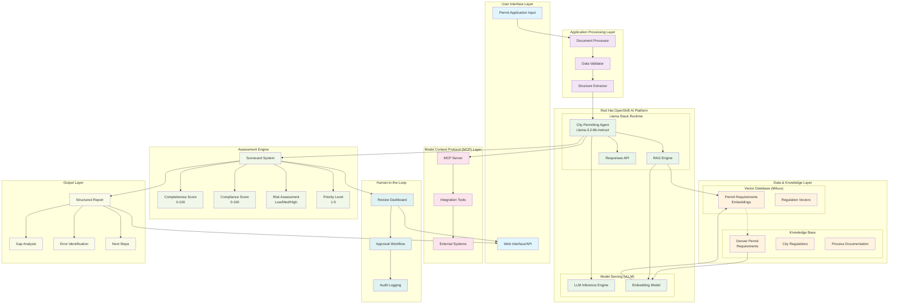

# City Permitting Agent - System Architecture Diagram



## System Flow Description

### 1. Input Processing (Steps 1-3)
```
Permit Application → Document Processing → Data Validation → Structure Extraction
```

### 2. AI Analysis (Steps 4-5)
```
Structured Data → Llama Agent → RAG Retrieval → Knowledge Base Query → Assessment
```

### 3. Scoring & Output (Step 6)
```
Agent Analysis → Scorecard Generation → Structured Report → Human Review Interface
```

## Key Integration Points

### OpenShift AI Platform
- **Model Deployment**: vLLM serves Llama-3.2-8b-instruct model
- **Resource Management**: GPU acceleration and auto-scaling
- **Container Orchestration**: Kubernetes-native deployment

### Llama Stack Components
- **Responses API**: Unified interface for agent interactions
- **RAG Engine**: Integrated retrieval-augmented generation
- **Vector Management**: Seamless Milvus integration

### Model Context Protocol (MCP)
- **Tool Integration**: Standardized external system access
- **API Connectivity**: Database and permit system integration
- **Context Management**: Maintains conversation and application state

## Data Architecture

### Vector Database Schema (Milvus)
```
Collection: permit_requirements
├── vector_field: requirement_embedding (768 dims)
├── id_field: requirement_id
├── metadata_fields:
    ├── category (zoning, safety, health, etc.)
    ├── jurisdiction (city, county, state)
    ├── priority_level (1-5)
    └── last_updated (timestamp)
```

### Knowledge Base Structure
```
Denver Permit Requirements/
├── zoning_requirements/
├── health_safety_codes/
├── fire_department_rules/
├── business_license_reqs/
└── food_service_regulations/
```

## Security & Compliance Architecture

### Authentication Flow
```
User → OAuth2/OIDC → OpenShift AI → RBAC → Agent Access
```

### Audit Trail
```
All Decisions → Audit Service → Compliance Database → Reporting Dashboard
```

## Deployment Architecture

### OpenShift Resources
```yaml
# Core Components
- Deployment: llama-stack-server
- Deployment: milvus-vector-db  
- Deployment: mcp-server
- Service: agent-api-service
- Route: public-access-route
```

### Resource Requirements
- **GPU Nodes**: 2x A100 (40GB VRAM each)
- **CPU/Memory**: 32 cores, 128GB RAM
- **Storage**: 1TB SSD for vector database

## Monitoring & Observability

### Key Metrics
- **Response Time**: Agent processing latency
- **Accuracy**: Scoring system precision
- **Throughput**: Applications processed per hour
- **Resource Utilization**: GPU/CPU usage patterns

### Alerting
- Model inference failures
- Vector database connectivity issues
- Score accuracy degradation
- System resource exhaustion