# City Permitting Agent - High-Level Architecture

## System Overview Diagram

```mermaid
flowchart TD
    %% External Interface
    USER[👤 User]
    
    %% Main System Boundary
    subgraph SYSTEM["🏛️ City Permitting Agent System"]
        %% Input Layer
        subgraph INPUT["📋 Input Processing"]
            API[REST API]
            UPLOAD[Document Upload]
            FORM[Application Form]
        end
        
        %% Core AI Engine
        subgraph AI["🤖 AI Processing Engine"]
            subgraph OPENSHIFT["☁️ Red Hat OpenShift AI"]
                subgraph LLAMASTACK["🦙 Llama Stack"]
                    AGENT[Permitting Agent<br/>Llama-3.2-8b]
                    RAG[RAG Engine]
                end
                VLLM[vLLM Runtime]
            end
        end
        
        %% Data Layer
        subgraph DATA["📊 Knowledge & Data"]
            VECTOR[Vector DB<br/>Milvus]
            KB[Knowledge Base<br/>Denver Regulations]
        end
        
        %% Integration Layer
        subgraph INTEGRATION["🔌 Integration Layer"]
            MCP[MCP Server]
            TOOLS[External Tools]
        end
        
        %% Assessment Engine
        subgraph ASSESSMENT["📈 Assessment Engine"]
            SCORECARD[Scorecard System]
            METRICS[Compliance Metrics]
        end
        
        %% Human Review
        subgraph REVIEW["👥 Human Review"]
            DASHBOARD[Review Dashboard]
            WORKFLOW[Approval Workflow]
        end
        
        %% Output
        subgraph OUTPUT["📄 Output Generation"]
            REPORT[Compliance Report]
            RECOMMENDATIONS[Recommendations]
        end
    end
    
    %% External Systems
    PERMIT_DB[(🏢 Permit Database)]
    CITY_SYS[🏛️ City Systems]
    
    %% User Flow
    USER --> INPUT
    INPUT --> AGENT
    
    %% AI Processing Flow
    AGENT <--> RAG
    AGENT --> VLLM
    RAG <--> VECTOR
    VECTOR <--> KB
    
    %% Integration Flow
    AGENT <--> MCP
    MCP <--> TOOLS
    TOOLS <--> PERMIT_DB
    TOOLS <--> CITY_SYS
    
    %% Assessment Flow
    AGENT --> SCORECARD
    SCORECARD --> METRICS
    METRICS --> DASHBOARD
    
    %% Review Flow
    DASHBOARD --> WORKFLOW
    WORKFLOW --> REPORT
    
    %% Output Flow
    SCORECARD --> REPORT
    REPORT --> RECOMMENDATIONS
    RECOMMENDATIONS --> OUTPUT
    OUTPUT --> USER
    
    %% Styling
    classDef userClass fill:#e3f2fd,stroke:#1976d2,stroke-width:2px
    classDef systemClass fill:#f3e5f5,stroke:#7b1fa2,stroke-width:2px
    classDef aiClass fill:#e8f5e8,stroke:#388e3c,stroke-width:2px
    classDef dataClass fill:#fff3e0,stroke:#f57c00,stroke-width:2px
    classDef integrationClass fill:#fce4ec,stroke:#c2185b,stroke-width:2px
    classDef externalClass fill:#f1f8e9,stroke:#689f38,stroke-width:2px
    
    class USER userClass
    class AI,OPENSHIFT,LLAMASTACK aiClass
    class DATA,VECTOR,KB dataClass
    class INTEGRATION,MCP,TOOLS integrationClass
    class PERMIT_DB,CITY_SYS externalClass
```



## Core Technology Stack

| Layer | Technology | Purpose |
|-------|------------|---------|
| **Platform** | Red Hat OpenShift AI | Container orchestration, ML model serving |
| **AI Runtime** | Llama Stack | Unified AI runtime for inference, RAG, agents |
| **Model** | Llama-3.2-8b-instruct | Primary language model for permit analysis |
| **Model Serving** | vLLM | High-performance LLM inference engine |
| **Vector DB** | Milvus | Semantic search and RAG retrieval |
| **Integration** | Model Context Protocol | Standardized AI-external system integration |
| **Frontend** | Streamlit/REST API | User interface and API access |

## Data Flow Summary

### 1. Application Intake
```
User Submission → API Processing → Document Extraction → Data Validation
```

### 2. AI Analysis
```
Structured Data → Llama Agent → RAG Query → Knowledge Retrieval → Analysis
```

### 3. Assessment & Scoring
```
AI Analysis → Scorecard Generation → Compliance Metrics → Risk Assessment
```

### 4. Human Review
```
Automated Score → Review Dashboard → Human Validation → Final Decision
```

### 5. Output Delivery
```
Final Assessment → Report Generation → Recommendations → User Notification
```

## Key Features

### 🎯 **Automated Permit Review**
- Intelligent analysis of food truck permit applications
- Compliance checking against Denver city regulations
- Automated gap identification and error detection

### 📊 **Scoring System**
- **Completeness Score**: 0-100% field completion
- **Compliance Score**: 0-100% regulatory alignment  
- **Risk Level**: Low/Medium/High risk assessment
- **Priority**: 1-5 urgency for human review

### 🔄 **Human-in-the-Loop**
- Review dashboard for city staff
- Approval workflow management
- Audit trail for all decisions

### 🔌 **System Integration**
- MCP-based external system connectivity
- Permit database integration
- City systems API access

## Security & Compliance

### 🔐 **Authentication & Authorization**
```
OAuth2/OIDC → Role-Based Access Control → Resource Permission
```

### 📋 **Audit & Compliance**
```
All Actions → Audit Log → Compliance Database → Reporting
```

### 🛡️ **Data Protection**
- Token-based API security
- Encrypted data at rest and in transit
- GDPR/privacy compliance

## Deployment Requirements

### 🖥️ **Hardware Requirements**
- **GPU**: 2x NVIDIA A100 (40GB VRAM each)
- **CPU**: 32 cores minimum
- **RAM**: 128GB minimum
- **Storage**: 1TB SSD for vector database

### ☁️ **OpenShift Requirements**
- OpenShift 4.17+
- GPU operator installed
- Persistent storage class
- Network policies configured

### 📦 **Container Images**
- `llamastack/distribution-ollama`
- `milvusdb/milvus`
- `vllm/vllm-openai`
- Custom MCP server image