# City Permitting Agent - Component Interaction Diagram

## Detailed Technical Architecture

```mermaid
graph LR
    %% External Layer
    subgraph EXTERNAL["🌐 External Layer"]
        USER[👤 User/Client]
        CITY_DB[(🏛️ City Database)]
        EXT_API[🔌 External APIs]
    end

    %% API Gateway Layer
    subgraph GATEWAY["🚪 API Gateway"]
        ROUTE[OpenShift Route]
        LB[Load Balancer]
        AUTH[Authentication]
    end

    %% Application Layer
    subgraph APP_LAYER["📱 Application Layer"]
        WEB_UI[Streamlit Web UI]
        REST_API[REST API Server]
        WEBSOCKET[WebSocket Handler]
    end

    %% Processing Layer
    subgraph PROCESSING["⚙️ Processing Layer"]
        DOC_PROC[Document Processor]
        VALIDATOR[Data Validator]
        PARSER[Structure Parser]
        ORCHESTRATOR[Workflow Orchestrator]
    end

    %% AI/ML Core
    subgraph AI_CORE["🧠 AI/ML Core"]
        subgraph LLAMA_STACK["🦙 Llama Stack Server"]
            direction TB
            AGENT_API[Agents API]
            INFERENCE_API[Inference API]
            RAG_ENGINE[RAG Engine]
            MEMORY_MGR[Memory Manager]
        end
        
        subgraph MODEL_SERVING["🚀 Model Serving"]
            VLLM_SERVER[vLLM Server]
            MODEL_CACHE[Model Cache]
            GPU_SCHEDULER[GPU Scheduler]
        end
    end

    %% Data Management Layer
    subgraph DATA_LAYER["💾 Data Management"]
        subgraph VECTOR_STORE["📊 Vector Store"]
            MILVUS[Milvus Server]
            EMBEDDINGS[Embeddings Cache]
            METADATA[Metadata Store]
        end
        
        subgraph KNOWLEDGE["📚 Knowledge Base"]
            REGULATIONS[Regulation Docs]
            PROCEDURES[Process Docs]
            EXAMPLES[Example Cases]
        end
        
        subgraph PERSISTENCE["💿 Persistence"]
            POSTGRES[(PostgreSQL)]
            REDIS[(Redis Cache)]
            FILE_STORE[File Storage]
        end
    end

    %% Integration Layer
    subgraph INTEGRATION["🔗 Integration Layer"]
        MCP_SERVER[MCP Server]
        TOOL_REGISTRY[Tool Registry]
        ADAPTER_LAYER[System Adapters]
        EVENT_BUS[Event Bus]
    end

    %% Monitoring & Observability
    subgraph OBSERVABILITY["📈 Observability"]
        METRICS[Prometheus Metrics]
        LOGS[Centralized Logging]
        TRACING[Distributed Tracing]
        ALERTS[Alert Manager]
    end

    %% Security Layer
    subgraph SECURITY["🔒 Security"]
        RBAC[Role-Based Access]
        SECRETS[Secret Management]
        AUDIT[Audit Logger]
        ENCRYPTION[Encryption Service]
    end

    %% Connection Flows
    USER --> ROUTE
    ROUTE --> LB
    LB --> AUTH
    AUTH --> WEB_UI
    AUTH --> REST_API
    
    WEB_UI --> WEBSOCKET
    REST_API --> ORCHESTRATOR
    WEBSOCKET --> ORCHESTRATOR
    
    ORCHESTRATOR --> DOC_PROC
    DOC_PROC --> VALIDATOR
    VALIDATOR --> PARSER
    PARSER --> AGENT_API
    
    AGENT_API --> INFERENCE_API
    AGENT_API --> RAG_ENGINE
    AGENT_API --> MEMORY_MGR
    
    INFERENCE_API --> VLLM_SERVER
    VLLM_SERVER --> MODEL_CACHE
    VLLM_SERVER --> GPU_SCHEDULER
    
    RAG_ENGINE --> MILVUS
    MILVUS --> EMBEDDINGS
    MILVUS --> METADATA
    
    AGENT_API --> MCP_SERVER
    MCP_SERVER --> TOOL_REGISTRY
    TOOL_REGISTRY --> ADAPTER_LAYER
    
    ADAPTER_LAYER --> CITY_DB
    ADAPTER_LAYER --> EXT_API
    
    ORCHESTRATOR --> POSTGRES
    ORCHESTRATOR --> REDIS
    ORCHESTRATOR --> FILE_STORE
    
    REGULATIONS --> MILVUS
    PROCEDURES --> MILVUS
    EXAMPLES --> MILVUS
    
    %% Monitoring connections
    AGENT_API -.-> METRICS
    VLLM_SERVER -.-> METRICS
    MCP_SERVER -.-> METRICS
    ORCHESTRATOR -.-> LOGS
    AGENT_API -.-> TRACING
    
    %% Security connections
    AUTH --> RBAC
    AUTH --> SECRETS
    ORCHESTRATOR --> AUDIT
    POSTGRES --> ENCRYPTION
    
    %% Event flows
    ORCHESTRATOR --> EVENT_BUS
    MCP_SERVER --> EVENT_BUS
    EVENT_BUS --> ALERTS
    
    %% Styling
    classDef external fill:#ffebee,stroke:#d32f2f,stroke-width:2px
    classDef gateway fill:#e8f5e8,stroke:#388e3c,stroke-width:2px
    classDef app fill:#e3f2fd,stroke:#1976d2,stroke-width:2px
    classDef processing fill:#f3e5f5,stroke:#7b1fa2,stroke-width:2px
    classDef ai fill:#fff3e0,stroke:#f57c00,stroke-width:2px
    classDef data fill:#e0f2f1,stroke:#00695c,stroke-width:2px
    classDef integration fill:#fce4ec,stroke:#c2185b,stroke-width:2px
    classDef observability fill:#f1f8e9,stroke:#689f38,stroke-width:2px
    classDef security fill:#fff8e1,stroke:#f9a825,stroke-width:2px
    
    class USER,CITY_DB,EXT_API external
    class ROUTE,LB,AUTH gateway
    class WEB_UI,REST_API,WEBSOCKET app
    class DOC_PROC,VALIDATOR,PARSER,ORCHESTRATOR processing
    class AGENT_API,INFERENCE_API,RAG_ENGINE,MEMORY_MGR,VLLM_SERVER,MODEL_CACHE,GPU_SCHEDULER ai
    class MILVUS,EMBEDDINGS,METADATA,REGULATIONS,PROCEDURES,EXAMPLES,POSTGRES,REDIS,FILE_STORE data
    class MCP_SERVER,TOOL_REGISTRY,ADAPTER_LAYER,EVENT_BUS integration
    class METRICS,LOGS,TRACING,ALERTS observability
    class RBAC,SECRETS,AUDIT,ENCRYPTION security
```



## Component Details

### 🚪 **API Gateway Layer**
| Component | Technology | Purpose |
|-----------|------------|---------|
| OpenShift Route | OpenShift Ingress | External traffic routing |
| Load Balancer | HAProxy/Nginx | Traffic distribution |
| Authentication | OAuth2/OIDC | User authentication |

### 📱 **Application Layer**
| Component | Technology | Purpose |
|-----------|------------|---------|
| Streamlit Web UI | Streamlit | Interactive web interface |
| REST API Server | FastAPI/Flask | HTTP API endpoints |
| WebSocket Handler | Socket.IO | Real-time communication |

### ⚙️ **Processing Layer**
| Component | Technology | Purpose |
|-----------|------------|---------|
| Document Processor | Python/PyPDF2 | Document parsing and extraction |
| Data Validator | Pydantic | Input validation and sanitization |
| Structure Parser | Custom Logic | Data structure transformation |
| Workflow Orchestrator | Celery/Custom | Task coordination and flow control |

### 🧠 **AI/ML Core**
| Component | Technology | Purpose |
|-----------|------------|---------|
| Llama Stack Server | Llama Stack | Unified AI runtime |
| vLLM Server | vLLM | High-performance model serving |
| RAG Engine | LlamaIndex/Custom | Retrieval augmented generation |
| Memory Manager | Redis/Custom | Context and session management |

### 💾 **Data Management**
| Component | Technology | Purpose |
|-----------|------------|---------|
| Milvus Server | Milvus | Vector database for embeddings |
| PostgreSQL | PostgreSQL | Relational data storage |
| Redis Cache | Redis | High-speed caching layer |
| File Storage | OpenShift Storage | Document and artifact storage |

### 🔗 **Integration Layer**
| Component | Technology | Purpose |
|-----------|------------|---------|
| MCP Server | Model Context Protocol | Standardized tool integration |
| Tool Registry | Custom Registry | Available tools and capabilities |
| System Adapters | Custom Adapters | External system connectors |
| Event Bus | Apache Kafka/Redis | Asynchronous messaging |

### 📈 **Observability Stack**
| Component | Technology | Purpose |
|-----------|------------|---------|
| Prometheus | Prometheus | Metrics collection and storage |
| Centralized Logging | Fluentd/ELK | Log aggregation and analysis |
| Distributed Tracing | Jaeger | Request tracing across services |
| Alert Manager | Prometheus AlertManager | Alert routing and management |

### 🔒 **Security Layer**
| Component | Technology | Purpose |
|-----------|------------|---------|
| RBAC | OpenShift RBAC | Role-based access control |
| Secret Management | OpenShift Secrets | Secure credential storage |
| Audit Logger | Custom/Fluentd | Security event logging |
| Encryption Service | OpenShift/TLS | Data encryption at rest/transit |

## API Interactions

### 📡 **External APIs**
```yaml
# REST API Endpoints
POST /api/v1/permits/submit           # Submit new permit application
GET  /api/v1/permits/{id}/status      # Check application status
GET  /api/v1/permits/{id}/report      # Get compliance report
PUT  /api/v1/permits/{id}/review      # Submit human review

# WebSocket Events
permit.processing.started             # Processing began
permit.analysis.progress             # Analysis progress update
permit.review.completed              # Review completed
permit.decision.final                # Final decision available
```

### 🔄 **Internal Service Communication**
```yaml
# Llama Stack APIs
POST /v1/agents/create               # Create new agent session
POST /v1/inference/chat_completion   # Model inference request
POST /v1/memory/insert               # Store conversation context
GET  /v1/memory/retrieve             # Retrieve relevant context

# MCP Protocol
mcp://tools/list                     # List available tools
mcp://tools/call/{tool_id}          # Execute tool with parameters
mcp://resources/read/{resource_id}   # Read external resource

# Vector Database
POST /collections/permit_reqs/search # Semantic search
POST /collections/permit_reqs/insert # Insert new documents
GET  /collections/permit_reqs/stats  # Collection statistics
```

## Data Flow Patterns

### 🔄 **Synchronous Flow**
```
User Request → API Gateway → Application Layer → Processing → AI Core → Response
```

### ⚡ **Asynchronous Flow**
```
Document Upload → Queue → Background Processing → Status Updates → Completion Notification
```

### 🔍 **RAG Query Flow**
```
User Query → Agent → RAG Engine → Vector Search → Context Retrieval → Enhanced Response
```

### 🛠️ **Tool Integration Flow**
```
Agent Decision → MCP Server → Tool Registry → System Adapter → External System → Result
```