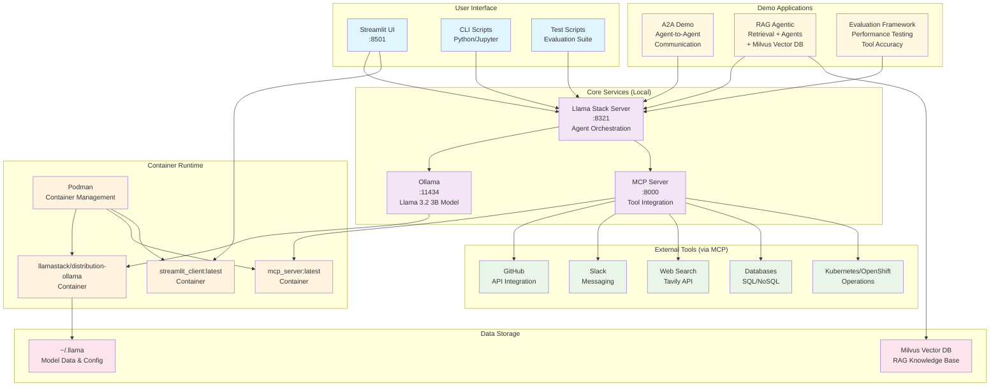

# Local Development Architecture Diagram



## Component Details

### Core Services
- **Llama Stack Server** (:8321) - Central orchestration for agents, tools, and models
- **Ollama** (:11434) - Local LLM inference serving Llama 3.2 3B model
- **MCP Server** (:8000) - Model Context Protocol server providing standardized tool access

### Container Runtime
- **Podman** - Manages all containerized services
- **Distribution Container** - Pre-built Llama Stack with Ollama integration
- **MCP Container** - Tool integration server
- **UI Container** - Streamlit web interface

### Demo Applications
- **A2A (Agent-to-Agent)** - Multi-agent coordination and communication
- **RAG Agentic** - Retrieval-augmented generation with agent capabilities
- **Evaluation Framework** - Performance testing and tool accuracy measurement

### External Integrations
All external tools accessed through standardized MCP (Model Context Protocol):
- GitHub API operations
- Slack messaging
- Web search capabilities  
- Database connections
- Kubernetes/OpenShift management

## Port Mapping
- **8321** - Llama Stack Server (main API)
- **11434** - Ollama model server
- **8000** - MCP tools server
- **8501** - Streamlit web UI

## Quick Start Commands
```bash
# Start entire local stack
make setup_local

# Build and run MCP tools
make build_mcp && make run_mcp_container

# Launch web UI
make build_ui && make run_ui

# Test with simple agent
python tests/scripts/0_simple_agent.py
```