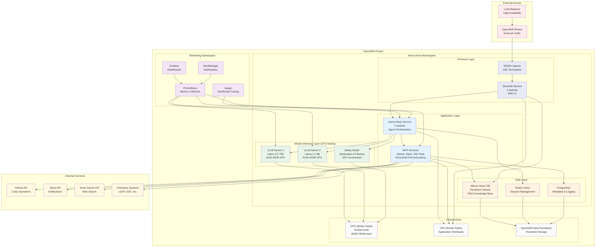

# OpenShift Production Architecture Diagram



## Production Deployment Features

### High Availability
- **Multiple Replicas** - All services run with 3+ replicas
- **Load Balancing** - OpenShift Routes with automatic load balancing
- **Auto-scaling** - Horizontal Pod Autoscaler based on CPU/memory
- **Health Checks** - Liveness and readiness probes for all services

### GPU Acceleration  
- **Dedicated GPU Nodes** - NVIDIA A100 GPUs with 40GB VRAM each
- **Multiple Model Servers** - Different model sizes for different use cases
- **Safety Model** - Dedicated moderation and content filtering
- **GPU Resource Management** - Kubernetes GPU scheduling and sharing

### Enterprise Integration
- **Security** - RBAC, NetworkPolicies, Pod Security Standards
- **Monitoring** - Full observability stack with Prometheus and Grafana
- **Logging** - Centralized logging with OpenShift Logging
- **Storage** - Enterprise persistent storage with OpenShift Data Foundation

### Scalability
- **Horizontal Scaling** - Independent scaling of each component
- **Resource Quotas** - Proper resource limits and requests
- **Network Policies** - Micro-segmentation and security
- **Rolling Updates** - Zero-downtime deployments

## Resource Requirements

### GPU Nodes (Minimum 2 nodes)
- **GPU**: NVIDIA A100 40GB or equivalent
- **CPU**: 16+ cores per node
- **Memory**: 128GB+ RAM per node
- **Storage**: 1TB+ NVMe SSD per node

### CPU Nodes (Minimum 3 nodes)
- **CPU**: 8+ cores per node  
- **Memory**: 32GB+ RAM per node
- **Storage**: 500GB+ SSD per node

### Network Requirements
- **Bandwidth**: 10Gbps+ cluster networking
- **External**: Dedicated egress for API calls
- **Security**: Firewall rules for external integrations

## Deployment Commands

```bash
# Create namespace
oc new-project llama-serve

# Deploy all components
oc apply -k kubernetes/kustomize/overlay/all-models

# Monitor deployment
oc get pods -w

# Check GPU allocation
oc describe nodes -l node-role.kubernetes.io/gpu=

# Access services
oc get routes
```