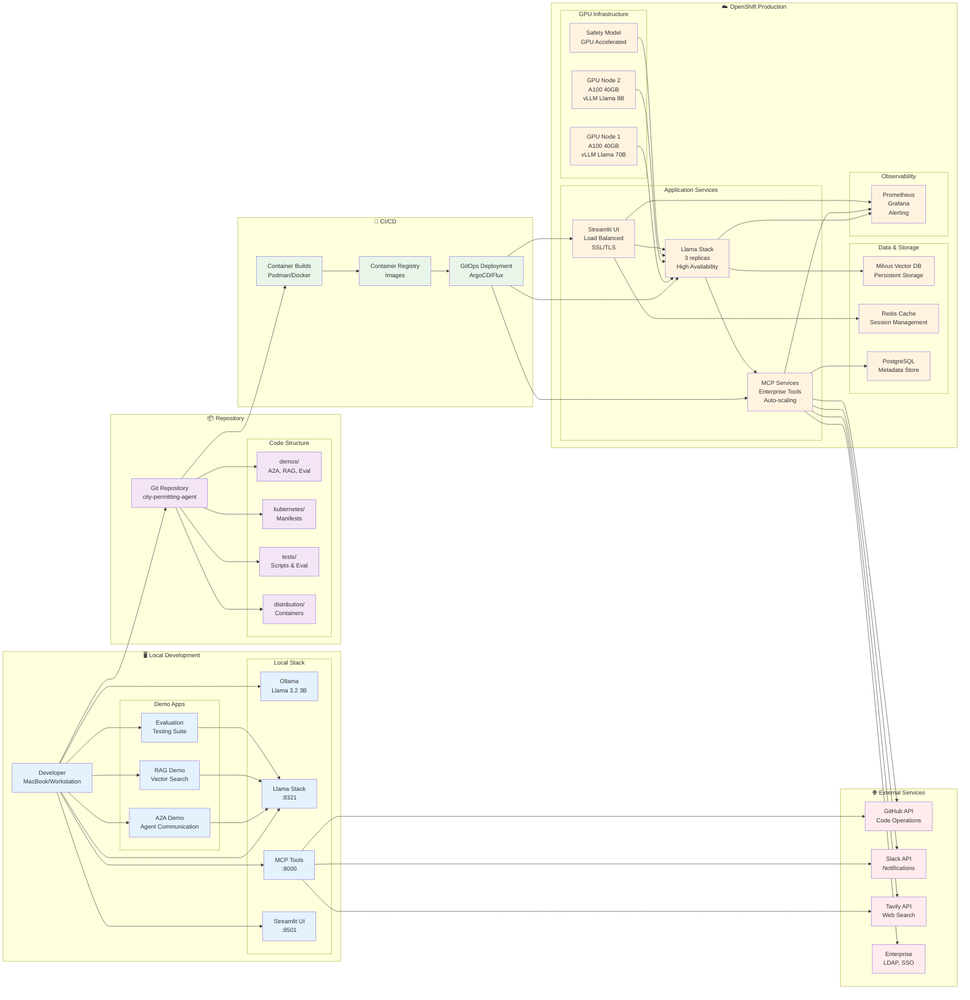

# System Overview Diagram

## Development to Production Flow

### 🖥️ Local Development
**Quick Start**: `make setup_local`
- **Ollama** serves Llama 3.2 3B model locally
- **Llama Stack** orchestrates agents and tools (:8321)
- **MCP Server** provides tool integrations (:8000)  
- **Streamlit UI** for interactive development (:8501)

### 📦 Repository Structure
**Three Demo Patterns**:
- **A2A**: Multi-agent communication systems
- **RAG**: Retrieval-augmented generation with vector search
- **Evaluation**: Performance testing and benchmarking

**Complete K8s Manifests**: Production-ready deployment configurations

### 🚀 CI/CD Pipeline  
**Container-Native Approach**:
- Build containers with `make build_*` commands
- Push to container registry
- Deploy via GitOps (ArgoCD/Flux) or direct `oc apply`

### ☁️ Production Environment
**Enterprise-Grade Deployment**:
- **GPU Acceleration**: NVIDIA A100 GPUs for model inference
- **High Availability**: Multiple replicas with load balancing
- **Scalability**: Horizontal pod autoscaling
- **Security**: RBAC, network policies, SSL/TLS
- **Observability**: Full monitoring and alerting stack

### 🌐 External Integrations
**Standardized via MCP Protocol**:
- GitHub for code operations
- Slack for notifications
- Web search capabilities  
- Enterprise systems (LDAP, SSO)

## Key Benefits

✅ **Seamless Development Experience**: Same APIs and patterns from laptop to production  
✅ **Complete Container Stack**: Everything runs in containers for consistency  
✅ **GPU-Optimized**: Designed for high-performance AI inference  
✅ **Enterprise Ready**: Security, monitoring, and scalability built-in  
✅ **Extensible**: Easy to add new tools and models via MCP protocol  

## Port Mapping Reference

| Service | Local Port | Production |
|---------|------------|-----------|
| Llama Stack | :8321 | Load Balanced |
| Ollama/vLLM | :11434 | GPU Nodes |
| MCP Tools | :8000 | Auto-scaled |
| Streamlit UI | :8501 | HTTPS Route |